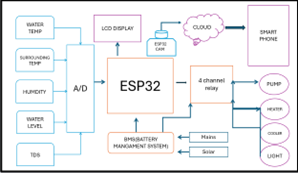
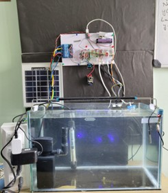
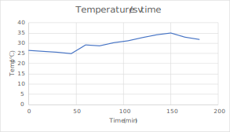
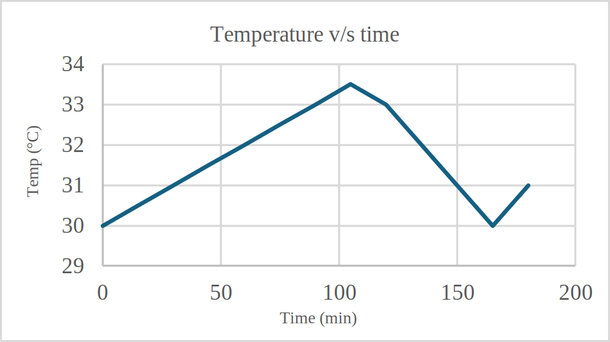
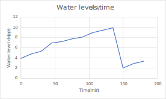
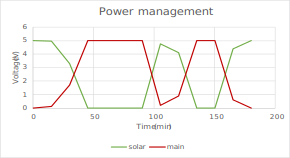
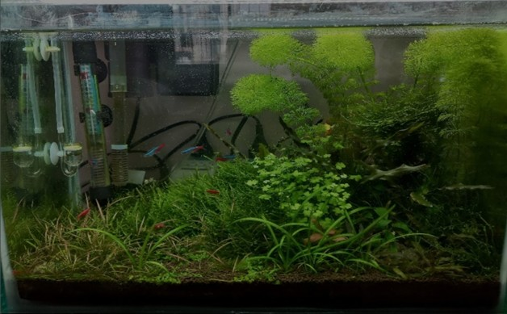
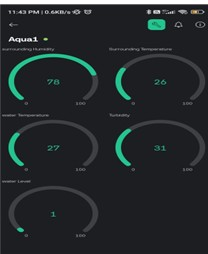

# Real-Time Smart Aquarium Monitoring System Driven by IoT

> An ESP32-based IoT system for comprehensive aquarium management — monitors water temperature, TDS, humidity, and water level in real-time, automates heating/cooling/pumping, and streams live video via ESP32-CAM. Solar-powered for eco-friendly continuous operation.


---

## 📄 Publication

> **Real-Time Smart Aquarium Monitoring System Driven by IoT**
> Tarun Patil, Sri Srujan Hari T, Anitha M
> *IEEE SETCOM 2025*
> DOI: `979-8-3315-2054-0/25/$31.00 ©2025 IEEE`

---

## 🐠 Overview

Traditional aquarium care requires constant manual monitoring and adjustments — prone to errors and insufficient for maintaining stable aquatic environments. This system automates everything: temperature regulation, water level management, and water quality monitoring, while providing remote access from anywhere via a mobile app and live video feed.

---

## 🏗️ System Architecture

```
[DS18B20]  [DHT22]  [TDS Sensor]  [Ultrasonic Level]
    \          |          |              /
     ──────────────────────────────────
                      ↓
              [ESP32 (Central Controller)]
              /          |           \
    [A/D Conversion]  [Wi-Fi]    [4-ch Relay Module]
                        ↓         /    |    |    \
                  [Blynk Cloud] [Pump][Heat][Cool][Light]
                        |
                  [Mobile App]
                        ↑
              [ESP32-CAM (Live Video)]

Power: [Solar Panel] → [BMS] → [Battery] → [ESP32 + Peripherals]
```

<p align="center">  </p>
<p align="center"> Block Diagram of the system </p>
---

## 🔧 Hardware Components

| Component | Model | Purpose |
|---|---|---|
| Main Controller | ESP32 | Central data acquisition, processing, Blynk communication |
| Water Temp Sensor | DS18B20 | Precise digital water temperature reading |
| Ambient Temp + Humidity | DHT22 | Surrounding environment monitoring |
| TDS Sensor | Generic TDS probe | Water purity (Total Dissolved Solids) measurement |
| Water Level Sensor | Ultrasonic | Measures water level; prevents overflow or low-water damage |
| Camera | ESP32-CAM | Live video streaming to Blynk app |
| Relay Module | 4-channel | Automates pump, heater, cooler, and lighting |
| Solar Panel | — | Primary power source |
| Battery + BMS | — | Energy storage + Battery Management System |
| Cloud Platform | Blynk | Remote monitoring, alerts, historical data, manual control |

<p align="center">  </p>
<p align="center"> Hardware setup </p>
---

## ⚙️ Automation Logic

| Condition | Action |
|---|---|
| Water temp < 25°C | Heater relay ON → heat water |
| Water temp > 33°C | Cooler relay ON → cool water |
| Water level below minimum | Pump relay ON → fill tank |
| Water level above maximum | Pump relay OFF → stop filling |
| TDS out of range | Alert sent to mobile app |
| Any parameter out of range | Push notification via Blynk |

---

## 📊 Performance Results

### Heating System
- Activates when water temperature drops below **25°C**
- Restores temperature to optimal range (**26–28°C**) rapidly
- System response and stabilisation are clearly visible in the temperature-vs-time graph

<p align="center">  </p>
<p align="center"> Heating system response graph </p>

### Cooling System
- Activates when water temperature exceeds **33°C**
- Gradually reduces temperature in a stable, controlled manner
- Prevents dangerous thermal extremes that can harm aquatic life

<p align="center">  </p>
<p align="center"> Cooling system performance graph</p>

### Water Level Regulation
- Automated relay-based control keeps water level within set parameters
- Minimal deviation from target level; rapid response to fluctuations

<p align="center">  </p>
<p align="center"> Automated water level control graph </p>

### Power Management
- Solar panels supply a significant portion of system energy needs
- BMS ensures reliable continuous operation even during low-sunlight periods
- Measurably reduces dependence on mains electricity

<p align="center">  </p>
<p align="center"> Solar power utilization and battery management performance </p>

### Video Monitoring
- ESP32-CAM provides real-time visual monitoring of the aquarium
- Enhanced visibility under varying lighting conditions
- Complements sensor data for a comprehensive monitoring experience

<p align="center">  </p>
<p align="center"> Real-time video monitoring interface </p>

---

## 📱 Mobile App Features (Blynk)

- **Real-time display** of water temp, level, TDS, humidity, power consumption
- **Push alerts** when any parameter crosses set thresholds
- **Historical data** access for trend analysis and maintenance planning
- **Remote control** — manually adjust temperature thresholds or toggle heater/cooler directly from phone
- **Live video** feed from ESP32-CAM

<p align="center">  </p>
<p align="center"> Blynk IoT mobile dashboard </p>
---

## 🌱 Sustainability

The solar panel + BMS power system makes this suitable for eco-friendly, off-grid operation — reducing electricity costs and environmental impact. This is particularly relevant for aquaponics-based organic farming applications.

---

## 🔮 Future Improvements

- pH sensor integration for complete water chemistry monitoring
- Adaptive algorithms that learn from historical data to anticipate parameter changes
- AI-based predictive analytics for proactive system management
- Enhanced security for data privacy
- Multi-tank dashboard with centralised monitoring

---

## 👥 Authors

| Name | Email | Affiliation |
|---|---|---|
| Tarun Patil | tarunpatil018@gmail.com | ECE, BMSIT&M |
| Sri Srujan Hari T | srujanharit1985@gmail.com | ECE, BMSIT&M |
| Anitha M (Guide) | anitham@bmsit.in | ECE, BMSIT&M |
